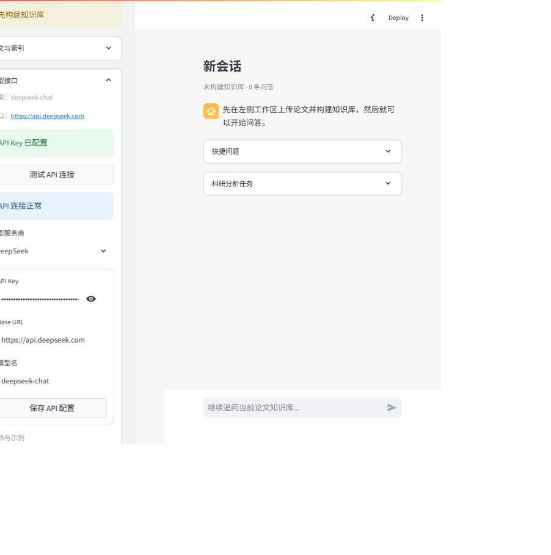
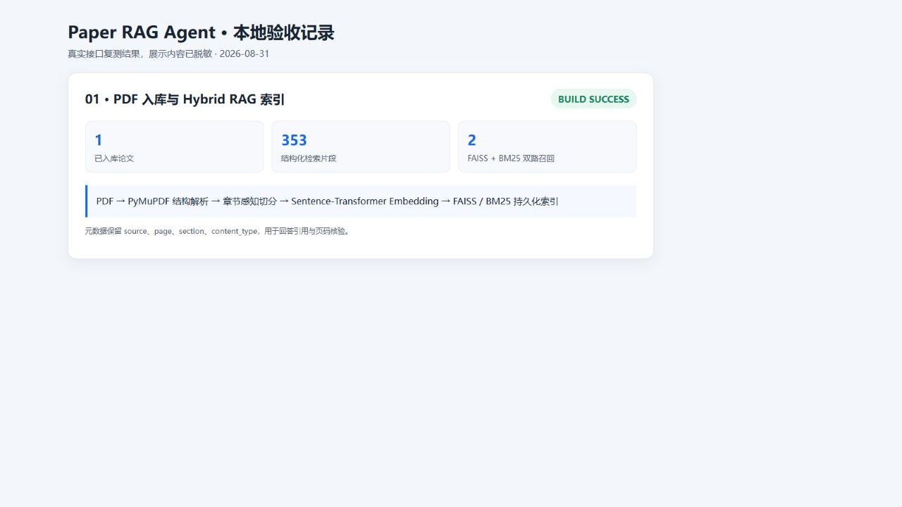
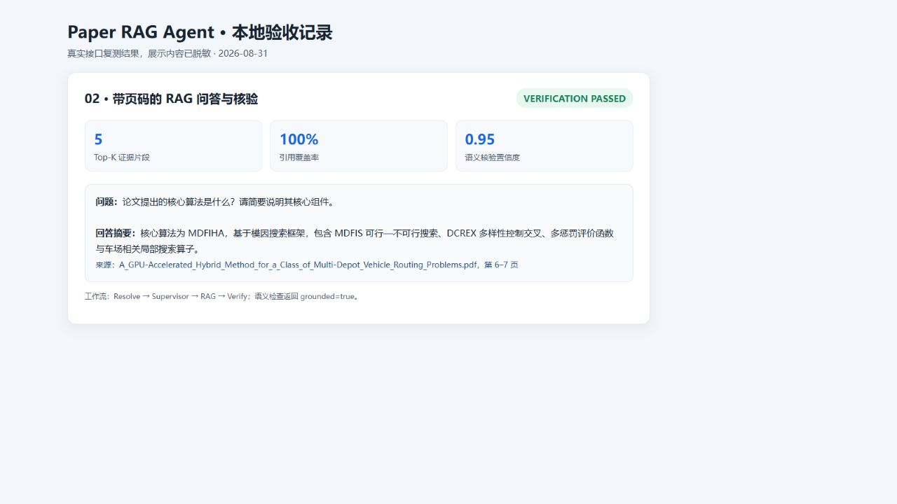
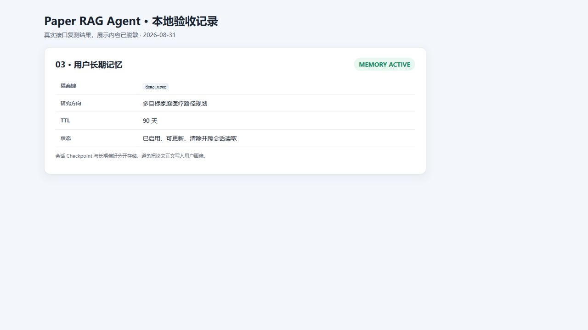
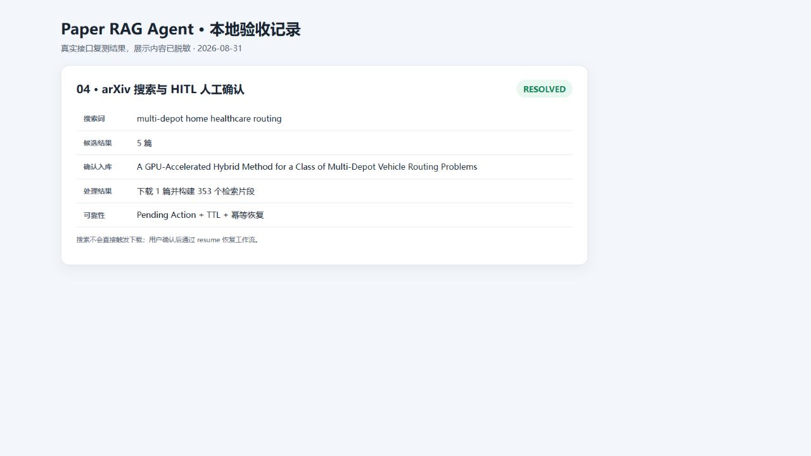

# paper-rag-agent

面向科研阅读与方法复现的 LangGraph 多智能体论文检索、PDF 解析、Hybrid RAG 问答与引用核验系统。

项目将论文发现、结构化解析、向量入库、混合检索、科研分析和来源核验组织为可恢复的工作流。重点不只是调用大模型，而是让回答尽量建立在可追溯的论文页码、表格和图片说明上。

## Highlights

- **LangGraph 多智能体工作流**：Resolve、Supervisor、Search、Ingest、Analysis、RAG、Report、Verify 与 Clarify 节点分工明确，状态转移由代码控制。
- **结构感知 PDF 解析**：基于 PyMuPDF 识别章节、页码、表格和嵌入图片，将表格转换为 Markdown，并关联图注与附近正文。
- **Hybrid RAG 检索**：Sentence-Transformer Dense Retrieval 与 BM25 混合召回，结合内容类型、章节和问题意图进行规则重排。
- **引用可追溯回答**：回答提示词要求标明论文文件名与页码；Verify 节点检查回答引用是否来自本轮检索证据。
- **状态与会话管理**：LangGraph SQLite Checkpointer 按 `user_id:session_id` 保存工作流状态，应用层保存会话、索引和报告。
- **可降级运行**：未配置大模型 API 时仍可完成 PDF 解析、索引构建和证据检索，便于本地调试。
- **可恢复 HITL 与长期记忆**：搜索结果确认带 TTL 和幂等恢复；用户偏好按 `user_id` 隔离，可开关、设置 TTL 和清除。
- **双入口交互**：同时提供 Streamlit 页面与 FastAPI/SSE 接口，支持上传、对话、审批恢复和记忆管理。
- **测试覆盖**：25 项自动化测试覆盖节点路由、引用归一化、记忆隔离、审批幂等、API、图表处理和结构化切分。

## Why This Project Matters

| 能力点 | 项目中的体现 |
| --- | --- |
| Agent workflow engineering | 使用 LangGraph StateGraph、条件边和 SQLite Checkpointer 编排多个职责节点 |
| Retrieval engineering | FAISS Dense + BM25 混合召回，并按章节、内容类型和问题意图重排 |
| Document intelligence | 解析正文、表格 Markdown、图片、图注、页码和章节元数据 |
| Reliability | 对无索引、无 API Key、检索为空和引用不匹配提供确定性处理 |
| Product implementation | Streamlit 与 FastAPI/SSE 支持多 PDF、用户会话、审批恢复、记忆管理和报告下载 |
| Evaluation awareness | 提供检索评测入口和自动化回归测试，不虚构线上效果指标 |

## Architecture

```text
用户请求
   |
Resolve --> Supervisor
   |          |
Clarify <-----|
   |-- Search Agent   ----> arXiv Atom API ----> 论文元数据
   |-- Ingest Agent   ----> PDF Loader --------> FAISS + BM25
   |-- Analysis Agent ----> 科研分析模板 -------|
   `-- RAG Agent      ----> Hybrid Retrieval ---|--> LLM Answer
                                                |
                                           Verify Agent
                                                |
                                         带来源的最终结果

SQLite Checkpointer <---- user_id + session_id ----> Streamlit 会话
User Memory SQLite <----------- user_id -----------> FastAPI / Streamlit
```

路由规则由代码确定，避免把所有职责堆进同一个 Prompt。Search 负责论文发现，Ingest 负责本地 PDF 入库，Analysis 处理总结、创新点、实验与复现问题，RAG 处理一般证据问答，Verify 最后检查引用映射。

## Tech Stack

| 模块 | 实现 |
| --- | --- |
| Agent workflow | LangGraph StateGraph + SQLite Checkpointer |
| LLM orchestration | OpenAI-compatible API |
| Academic search | arXiv Atom API |
| Vector retrieval | FAISS |
| Embedding | Sentence-Transformer |
| Sparse retrieval | BM25 |
| PDF parsing | PyMuPDF |
| Frontend | Streamlit |
| Testing | pytest |

## Core Design

### Multi-Agent Workflow

- **Supervisor**：读取问题、PDF 输入和知识库状态，确定后续节点。
- **Resolve**：处理显式研究偏好和常见多轮指代；缺少上下文时转入 Clarify。
- **Clarify**：在论文指代无法落到当前线程时向用户追问，不直接猜测。
- **Search**：根据关键词调用 arXiv Atom API，返回题目、作者、摘要、发布时间和链接。
- **Ingest**：解析传入 PDF，执行结构感知切分并构建 FAISS/BM25 索引。
- **Analysis**：处理论文总结、创新点、实验设置、算法比较、适用性判断和复现建议。
- **RAG**：结合会话上下文检索证据，调用模型生成带论文名和页码的回答。
- **Report**：生成包含问题、方法、实验、局限、复现和未来方向的结构化科研报告。
- **Verify**：解析回答中的来源标记，核对其能否映射到本轮召回片段。

### Retrieval Pipeline

```text
Query
  |-- Dense Retrieval (Sentence-Transformer + FAISS)
  |-- Sparse Retrieval (BM25)
  `-- Query-aware candidate expansion
                 |
         Merge + Deduplicate
                 |
     Rule-based intent reranking
                 |
       Top-K evidence chunks
```

Dense Retrieval 负责语义匹配，BM25 补充论文名、缩写、算法名和指标等精确词匹配。重排阶段根据问题是否关注方法、实验、数据集、局限性或参考文献调整相关片段顺序。

### PDF Ingestion

- 在章节边界内按段落和句子递归切分，降低跨章节语义混杂。
- 保存文件名、页码、章节路径和内容类型等元数据。
- 表格转为 Markdown；大表分块时重复表头。
- 提取嵌入图片并关联 Figure Caption、页码与附近正文。
- 对正文、表格、图片说明建立统一检索索引。

### Verification Boundary

当前 Verify Agent 执行**确定性引用映射检查**：核对回答中的来源名称是否出现在本轮召回证据中，并计算引用覆盖率。它不是完整的事实级 NLI/LLM AnswerGuard，不能证明每个自然语言主张都得到证据支持。

## Quick Start

### 1. Install

建议使用 Python 3.10 或更高版本。

```bash
git clone https://github.com/Lyq-QLU/paper-rag-agent.git
cd paper-rag-agent
python -m venv .venv
```

Windows：

```powershell
.\.venv\Scripts\Activate.ps1
pip install -r requirements.txt
```

Linux / macOS：

```bash
source .venv/bin/activate
pip install -r requirements.txt
```

### 2. Configure

可在 `.streamlit/secrets.toml` 中配置 OpenAI 兼容接口：

```toml
OPENAI_API_KEY = "your-api-key"
OPENAI_BASE_URL = "https://api.openai.com/v1"
OPENAI_MODEL = "gpt-4o-mini"
```

参考 `.streamlit/secrets.toml.example` 和 [API_SETUP.md](API_SETUP.md)。密钥文件已被 `.gitignore` 排除。

### 3. Run

```bash
streamlit run app.py
```

上传一篇或多篇 PDF，构建知识库并开始提问。典型问题：

- 这篇论文的核心创新点是什么？
- 实验使用了哪些数据集和评价指标？
- 这个算法能否作为我的对比算法？
- 按模块说明如何复现该方法。
- 搜索近期有关 multi-depot routing 的 arXiv 论文。

### 4. Test

```bash
python -m pytest -q
```

当前测试结果：`25 passed`。

### 5. Run API

```bash
uvicorn api:app --reload --host 0.0.0.0 --port 8000
```

主要接口包括 `/api/chat`、`/api/chat/stream`、`/api/chat/resume`、`/api/upload-pdf`、`/api/approvals`、`/api/threads`、`/api/papers` 和 `/api/user-profile`。

## Project Structure

```text
paper-rag-agent/
├── app.py
├── requirements.txt
├── src/
│   ├── agent_workflow.py   # LangGraph 状态、节点、条件边与 Checkpointer
│   ├── agent_memory.py     # 长期偏好、TTL 和可恢复审批
│   ├── analysis_tasks.py   # 科研分析任务模板
│   ├── paper_loader.py     # PDF 正文、表格、图片与结构解析
│   ├── rag_pipeline.py     # FAISS/BM25、混合召回与重排
│   ├── evaluation.py       # 检索评测
│   ├── session_manager.py  # 用户、会话、索引与报告管理
│   ├── llm.py              # OpenAI 兼容模型调用
│   └── config.py           # 配置读取
└── tests/
    ├── test_agent_workflow.py
    └── test_structured_chunking.py
```

## Interview & Demo Materials

- [项目面试问答](docs/INTERVIEW_GUIDE.md)：关键参数、技术选型、高频追问与能力边界。
- [3 分钟演示脚本](docs/DEMO_SCRIPT.md)：从 PDF 入库到 RAG、长期记忆、HITL 和报告生成。
- [求职版验收清单](docs/ACCEPTANCE_CHECKLIST.md)：功能证据、仓库安全与投递前检查。

### Demo Preview



### Verified Evidence

| PDF 入库 | RAG 与引用核验 |
| --- | --- |
|  |  |
| 长期记忆 | HITL 人工确认 |
|  |  |

## Known Limits

- Supervisor 当前采用确定性关键词和状态规则，尚未使用 LLM 结构化意图路由。
- Search 支持 arXiv 搜索、选择、下载和入库，但尚未接入 OpenAlex/MCP 多源检索。
- Resolve/Clarify 已覆盖常见指代与缺失上下文，复杂候选标题消歧仍需增强。
- Verify 提供确定性引用映射和可选 LLM 语义检查，但事实拆分与结构化判定仍需增强。
- SQLite Checkpointer 和本地文件存储适合单机演示，不适合高并发生产环境。
- 暂无正式用户认证、MCP 和扫描页 OCR；`user_id` 是隔离键而非安全身份凭证。
- 图片处理基于图注与附近文本，不进行像素级视觉理解。

## Roadmap

- 增强基于候选标题、作者和 arXiv ID 的多轮指代消歧。
- 接入 OpenAlex/MCP 多源检索并统一相关性评分。
- 将 Verify 升级为主张拆分、结构化判定与证据不足拒答结合的 AnswerGuard。
- 增加 token 级模型流式输出、用户认证和更完整的真实标注评测集。

## Disclaimer

本项目用于学习和科研辅助。模型回答可能存在遗漏或错误，重要结论应回到原论文及页码复核。
